# planB 

## Project title
planB is an app which encourages users to spend their time at home more productively by suggesting courses, exercises and other recreational activities that they can do at home.

## Tech/framework used
HTML, CSS, JavaScript, wrapped with Cordova

## Features
### Home Page
Allows users to have an overview of their weekly productive hours and access different tabs by clicking on the boxes in the homepage or icons on the bottom navigation bar.

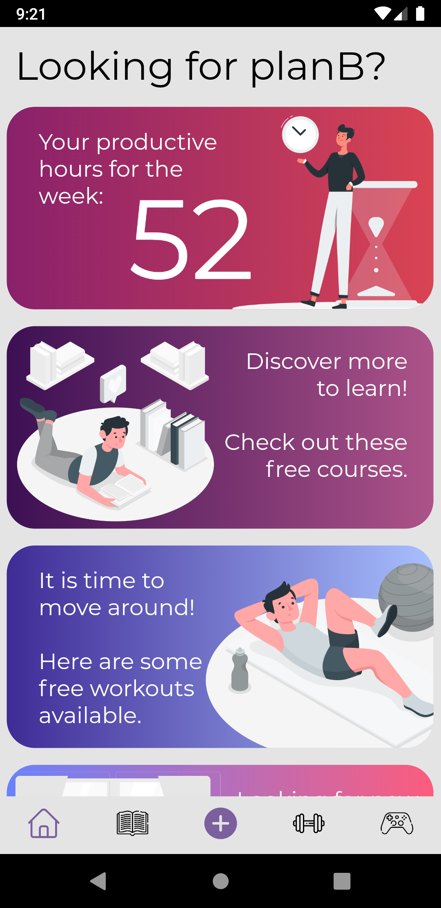

### Add Time Tab
Accessed by clicking on the plus icon on the bottom navigation bar.
 
Allows users to log the time spent for each activity type, describe their feelings and additional notes.
 
Click submit button to update logged hours for selected activity type.

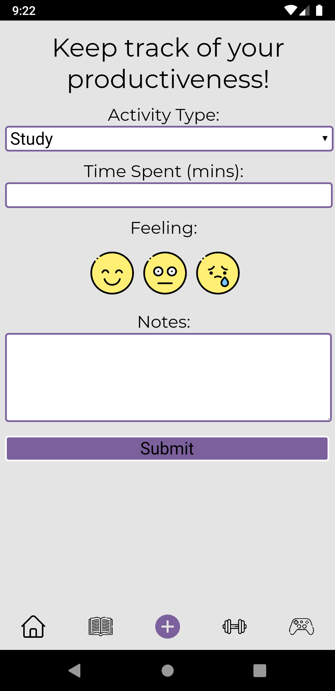

### Statistics Page
Shows the weekly breakdown of hours spent on each activity.

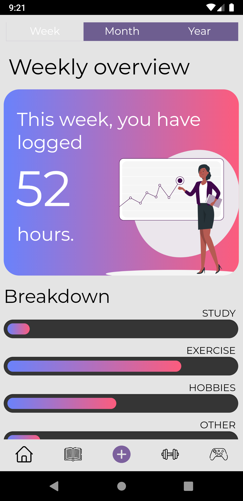

Shows the monthly calendar and number of hours logged each day.

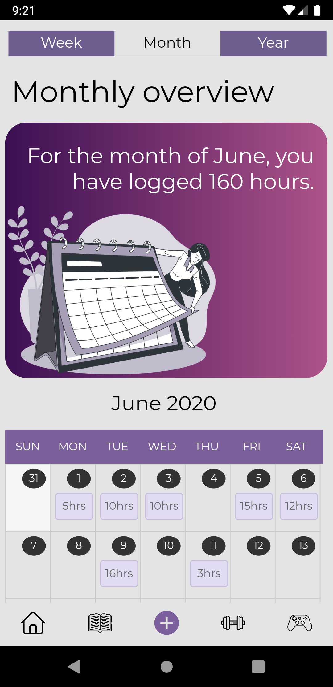

Shows the total logged hours yearly, highest logged hours by day, month, and activity of the year.

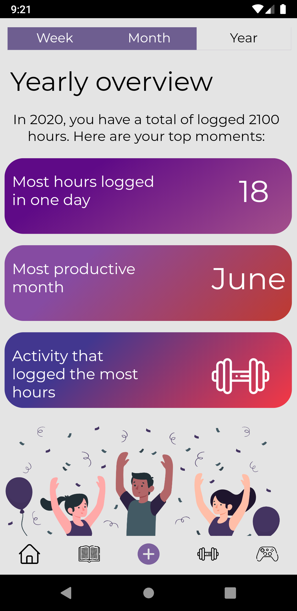

### Study Tab
Categories: Coding, Languages, Marketing. 

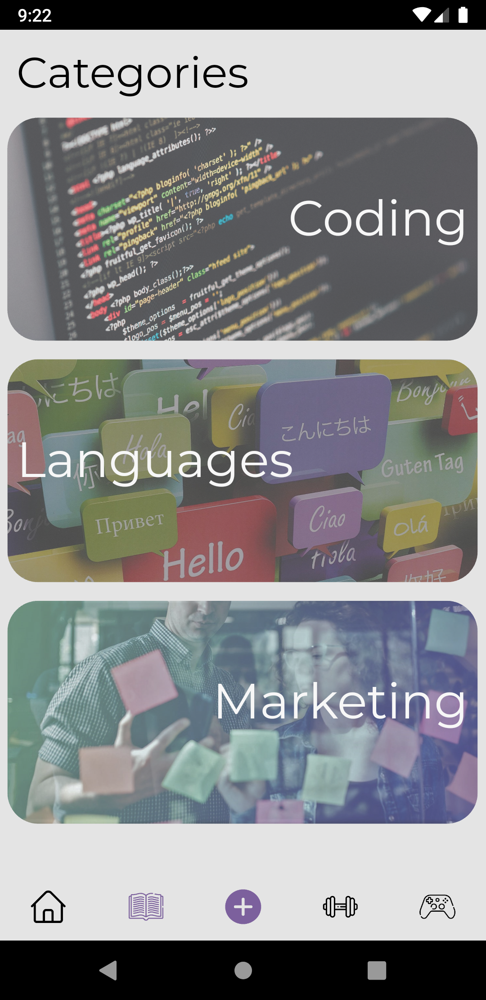

Directs users to the course website on click.
 
Ratings is provided to facilitate decision making.

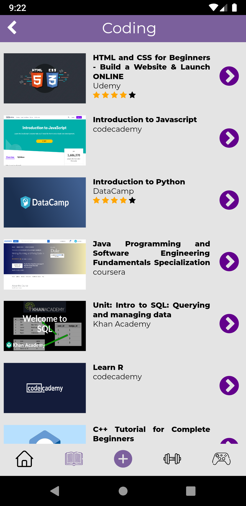

### Exercise Tab
Categories: HIIT, Arms, Abs, Under 10 Minutes, Under 30 Minutes. 

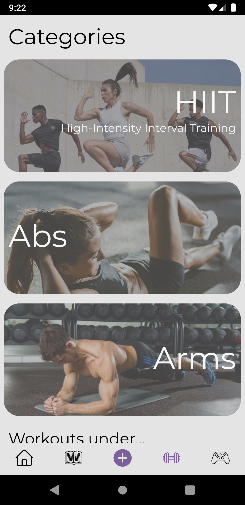

Directs users to the YouTube video on click via the play button.
 
Duration is provided to help in time-management.

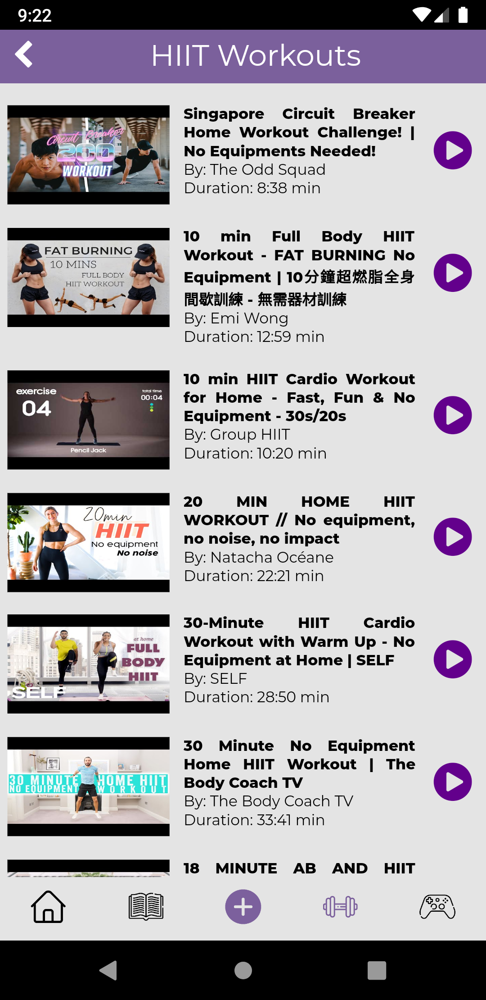

### Hobbies Tab
Categories: What's Trending, Cooking, Arts & Crafts, Design. 

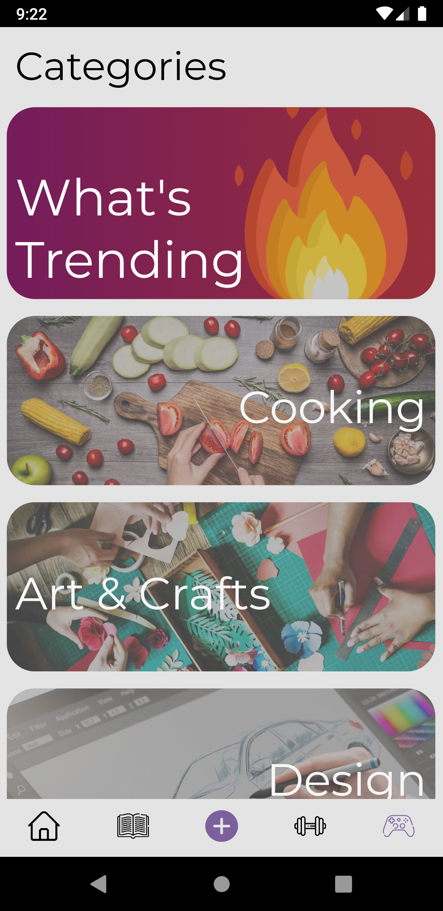

Directs users to the YouTube video on click via the thumbnail.
 
Duration is provided to help in time-management.

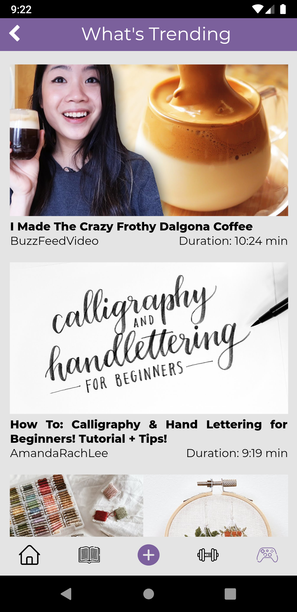

## Contributors
Carine Tan Kailin: http://github.com/carine99
 
Koh Gladys: http://github.com/gladyskoh
 
Koh Min: https://github.com/kohmin
 
Tay Hui Xin, Jade: https://github.com/jadetayy

